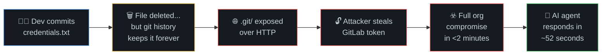
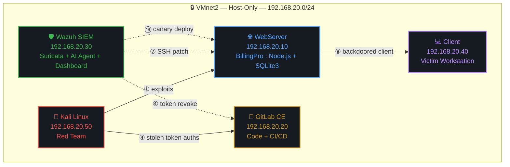
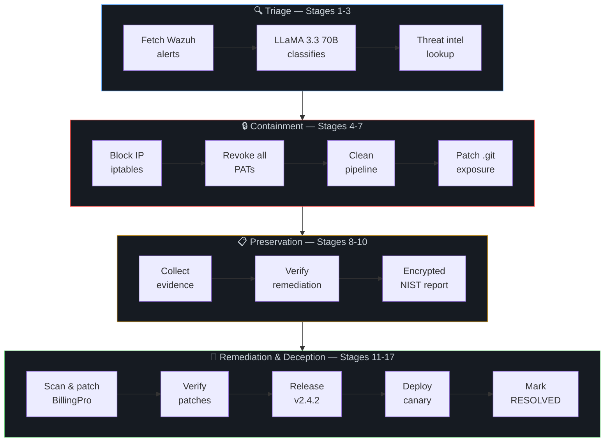
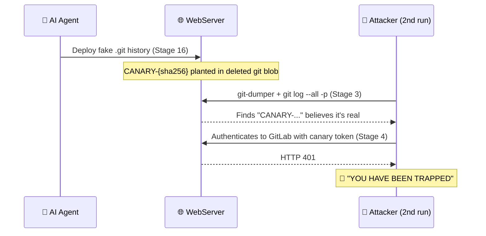

<div align="center">

# 🕳️ SHADOWPIPE

### AI-Powered Supply Chain Attack Simulation & Autonomous Defense

*One leaked credential. Five compromised machines. A 17-stage AI response in under a minute.*

[](#)
[](#)
[](#)
[](#)


</div>

<br>

> Built as a capstone project for **CDAC's PGCP-ITISS** (Post Graduate Certificate Programme in IT Infrastructure Security & Surveillance). SHADOWPIPE is a fully working 5-VM lab — not a diagram — in which a scripted attacker really compromises a fictional company end-to-end, and an autonomous LLM agent really detects, blocks, patches, and re-deceives it, live, over real API calls, SSH, and iptables.

<br>

## 📑 Table of Contents

| | | |
|---|---|---|
| [🎯 What This Actually Does](#-what-this-project-actually-does) | [🗺️ Lab Topology](#️-lab-topology) | [⚔️ The Attack — 10 Stages](#️-the-attack-10-stages) |
| [🛡️ The Defense — 17 Stages](#️-the-defense-17-stage-ai-agent) | [🪤 Canary Deception](#-the-canary-deception-layer) | [📊 Live Dashboard](#-live-dashboard-output) |
| [▶️ Running the Demo](#️-running-the-demo) | [🧰 Tech Stack](#-tools--technology-stack) | [📈 Metrics](#-results--metrics) |
| [🧩 Framework Coverage](#-framework-coverage) | [⚠️ Known Limitations](#️-known-limitations-intentional) | [📂 Repo Layout](#-repository-layout) |

<br>

---

## 🎯 What This Project Actually Does

SHADOWPIPE tells one story, twice — once from the attacker's side, once from the defender's:



**The thesis, in two parts:**

1. **The attack surface most teams ignore is now the most dangerous one.** Leaked credentials in version control + unmonitored software supply chains beat almost every perimeter control money can buy.
2. **Autonomous, LLM-driven response can close the 197-day industry gap to under a minute** — while being explicit about exactly where that automation is still naive (see [Known Limitations](#️-known-limitations-intentional)).

<br>

---

## 🗺️ Lab Topology

Five VMs, one **host-only** network (`VMnet2`, `192.168.20.0/24`), **zero route to the internet or host machine**. Attack traffic never leaves the lab.



<div align="center">

| Machine | IP | OS | Role |
|:---|:---:|:---|:---|
| 🔴 **Kali** | `192.168.20.50` | Kali Linux 2024 | Red Team — `attack.py`, reverse shell (`:4444`) & credential-exfil (`:5555`) listeners |
| 🌐 **WebServer** | `192.168.20.10` | Ubuntu Server 24.04 | FakeCorp's site + BillingPro app (port 80) |
| 🦊 **GitLab** | `192.168.20.20` | Ubuntu Server 24.04 | Self-hosted GitLab CE — hosting + CI/CD + REST API |
| 🛡️ **Wazuh** | `192.168.20.30` | Ubuntu Server 24.04 | Blue Team — Suricata, Wazuh SIEM, AI agent, dashboard |
| 💻 **Client** | `192.168.20.40` | Ubuntu Desktop | Victim — downloads & runs the billing client |

</div>

<details>
<summary><b>🔌 Port Map</b> (click to expand)</summary>
<br>

| Port | Protocol | Purpose |
|:---:|:---:|:---|
| `80` | HTTP | BillingPro web app / GitLab web + API |
| `55000` | HTTPS | Wazuh API |
| `9999` | HTTP | Dashboard status listener — **exempted** from the iptables block so status still flows on the attacker's second attempt |
| `4444` | TCP | Attacker's reverse shell listener |
| `5555` | HTTP | Attacker's credential-exfiltration listener |

</details>

<br>

---

## ⚔️ The Attack: 10 Stages

Fully automated from a single script (`attack.py`), with two shells the operator interacts with manually.


<table>
<tr><th>#</th><th>Stage</th><th>What Happens</th></tr>
<tr><td>1</td><td>🔎 <b>.git Discovery</b></td><td><code>GET /.git/HEAD</code> → <code>200 OK</code>. Express is serving dotfiles (<code>dotfiles: 'allow'</code>) it should never expose.</td></tr>
<tr><td>2</td><td>📦 <b>Repo Reconstruction</b></td><td><code>git-dumper</code> rebuilds the entire repo — including deleted files — purely from exposed <code>.git/objects/</code>.</td></tr>
<tr><td>3</td><td>🔑 <b>Secret Extraction</b></td><td><code>git log --all -p</code> greps every historical diff for <code>GITLAB_TOKEN</code>, <code>DB_PASSWORD</code>, <code>AWS_KEY</code> — all "removed," none actually gone.</td></tr>
<tr><td>4</td><td>🦊 <b>GitLab Auth</b></td><td>Stolen PAT authenticates directly to the REST API — tokens carry the exact privilege of their creator.</td></tr>
<tr><td>5</td><td>☠️ <b>Pipeline Poisoning</b></td><td><code>.gitlab-ci.yml</code> overwritten via API. Beacons to the attacker on every future push — persistent C2.</td></tr>
<tr><td>6</td><td>📡 <b>DNS Exfiltration</b></td><td>Stolen token base64-tunneled out as DNS queries — a channel many firewalls never inspect.</td></tr>
<tr><td>7</td><td>🎭 <b>Decoy Probe</b></td><td>Checks <code>/.canary</code>, <code>/.honeypot</code>, <code>/.decoy</code> — obvious bait for the <i>real</i> trap (see below).</td></tr>
<tr><td>8</td><td>💥 <b>Web Shell</b></td><td>SQLi bypasses login, command injection in <code>/api/system/diagnostics</code> lands a <b>root</b> reverse shell.</td></tr>
<tr><td>9</td><td>🧬 <b>Supply Chain</b></td><td><code>BillingPro_Client.py</code> swapped for a backdoored build — reverse shell fires <i>instantly</i> on execution, before any login.</td></tr>
<tr><td>10</td><td>🗃️ <b>Data Exfil</b></td><td><code>UNION</code>-based SQLi dumps the full <code>users</code> table — usernames, hashes, roles.</td></tr>
</table>

> 💡 **Why "deleting" a secret from Git doesn't work:** `git rm` only clears the *working tree* — the blob still lives in `.git/objects/` forever. `git revert` doesn't help either; it adds a commit, it doesn't erase one. Only `git filter-repo` / `BFG Repo-Cleaner` truly rewrites history.

After Stage 10, `attack.py` calls `trigger_agent()` — one `GET` to `:9999/trigger` — handing control to the AI defender.

<br>

---

## 🛡️ The Defense: 17-Stage AI Agent

Wazuh flags the attack at severity 15 (Active Response), launches `ai_agent.py`, and from there it's fully autonomous — no human in the loop.



<table>
<tr><th>Phase</th><th>Stages</th><th>Actions</th></tr>
<tr><td>🔍 <b>Triage</b></td><td>1–3</td><td>Pull Wazuh alerts → classify with <b>LLaMA 3.3 70B</b> (attack type, severity, attacker IP, confidence) → check threat intel (AbuseIPDB, VirusTotal)</td></tr>
<tr><td>🔒 <b>Containment</b></td><td>4–7</td><td><code>iptables DROP</code> the attacker (port <code>9999</code> exempt) → revoke <i>every</i> GitLab PAT → clean the poisoned pipeline → patch <code>.git</code> exposure over SSH</td></tr>
<tr><td>📋 <b>Preservation</b></td><td>8–10</td><td>Collect forensic evidence into <code>INC-YYYYMMDD-HHMMSS/</code> → verify the fix actually worked → generate a <b>Fernet-encrypted</b> report mapped to NIST CSF</td></tr>
<tr><td>🔧 <b>Remediation & Deception</b></td><td>11–17</td><td>Patch all 3 real RCE vectors → verify each patch → release safe <b>v2.4.2</b> client → deploy the canary trap → mark <code>RESOLVED</code></td></tr>
</table>

### 🧠 The LLM in the Loop

<div align="center">

| Parameter | Value | Reason |
|:---|:---:|:---|
| Model | `llama-3.3-70b-versatile` | Strong reasoning, free-tier, sub-second inference on Groq's LPU |
| Temperature | `0.1` | Near-deterministic — minimizes hallucinated classifications |
| Max tokens | `256` | Forces concise, reliably parseable JSON |
| Input | Top 5 alerts, first 2000 chars | Fits context, keeps latency low |

</div>

> ⚙️ **Fail-safe design:** if Groq is unreachable, the agent falls back to a hardcoded worst-case decision (`CRITICAL / Supply Chain`) and still runs full containment. Malformed JSON responses default to `attack_detected: True` via `setdefault()`. The system is deliberately **biased toward action over inaction** — a real trade-off, not an oversight (see [Limitations](#️-known-limitations-intentional)).

<br>

---

## 🪤 The Canary Deception Layer

The most interesting design decision in the project — and easy to undersell in a live demo.



- Stage 7's `/.canary`, `/.honeypot`, `/.decoy` probes are **bait for the bait** — deliberately obvious so a sophisticated attacker checks, finds nothing, and feels reassured.
- The **real** trap, deployed at Stage 16, is a `CANARY-{sha256[:24]}` token hidden inside the **deleted git object history** of a freshly generated fake `.git` directory — structurally identical to the original leak.
- Because it lives inside git objects rather than as a file, **none** of Stage 7's filesystem probes can ever find it.
- On the attacker's next run, they extract it at Stage 3, try to authenticate with it at Stage 4, get `401` — trap sprung.

> 🎯 **The point:** the deception survives the attacker's own deception-detection routine. They invest four full stages of effort before discovering they've been caught.

<br>

---

## 📊 Live Dashboard Output

A terminal-native dashboard (Python **Rich Live**, 2 Hz refresh) polls two JSON files and renders a live view of both sides of the fight:

<div align="center">

| File | Written By | Contains |
|:---|:---|:---|
| `/tmp/attack_status.json` | `attack.py` → `POST :9999` | Red team stage, label, status |
| `/home/wazuh/evidence/AGENT_STATUS.json` | `ai_agent.py` | Blue team stage, label, elapsed breach time |

</div>

```
┌─ SHADOWPIPE LIVE ────────────────────────────────────────────┐
│  STATE: DEFENSE                     ELAPSED: 00:00:47         │
├─────────────────────────────┬──────────────────────────────────┤
│  🔴 RED TEAM (10 stages)     │  🟢 BLUE TEAM (17 stages)         │
│  ✅ .git Scan                │  ✅ Fetch Alerts                  │
│  ✅ Repo Dump                │  ✅ AI Classification              │
│  ✅ Secrets                  │  ✅ Threat Intel                  │
│  ✅ GitLab Auth              │  ✅ Block Attacker IP              │
│  ✅ Pipeline                 │  ✅ Revoke PATs                    │
│  ✅ DNS Exfil                │  ✅ Clean Pipeline                 │
│  ✅ Decoy Probe              │  ⏳ Patch .git Exposure            │
│  ✅ Web Shell                │  ⬜ Collect Evidence               │
│  ✅ Supply Chain             │  ⬜ Encrypted Report               │
│  ✅ Data Exfil               │  ⬜ Patch BillingPro                │
├─────────────────────────────┴──────────────────────────────────┤
│  💰 BREACH COST: $13.63  (accruing at $0.29/sec)              │
│  📁 EVIDENCE: /home/wazuh/evidence/INC-20260728-...            │
└──────────────────────────────────────────────────────────────┘
```

> The breach-cost counter is built on IBM Ponemon Institute's **$4.88M average breach cost ÷ 197-day average response = $0.29/sec**. It freezes on resolution and shows the dollar amount "saved" by responding in ~52 seconds instead of 197 days.

<br>

---

## ▶️ Running the Demo

```bash
# 1️⃣ Wazuh VM — reset the environment, start the dashboard
bash /home/wazuh/reset_all.sh

# 2️⃣ Kali VM — automated 10-stage attack begins
python3 /home/kali/attack.py

# 3️⃣ Kali VM — interact with Shell 1 (webserver root shell), Ctrl-D to continue

# 4️⃣ Client VM — download & run the client
wget http://192.168.20.10/api/client/download -O bp.py && python3 bp.py
#     Log in with anything — the reverse shell already fired on execution

# 5️⃣ Kali VM — interact with Shell 2 (client, via supply chain RCE), Ctrl-D

# 6️⃣ Attack completes → AI agent triggers automatically on Wazuh
#     Watch the dashboard: IP blocked → tokens revoked → .git patched →
#     BillingPro patched → v2.4.2 released → canary deployed → RESOLVED

# 7️⃣ Run the attack again — two possible outcomes:
python3 /home/kali/attack.py
```

<div align="center">

| If `.git` was hard-patched | If the canary `.git` was restored |
|:---:|:---:|
| ❌ **Stage 1 fails**<br>`VULNERABILITY PATCHED BY BLUE TEAM` | 🚨 **Stage 4 triggers the trap**<br>`YOU HAVE BEEN TRAPPED` |

</div>

`reset_all.sh` (Wazuh) + `reset_web.sh` (WebServer, over SSH) together flush firewalls, **rotate the GitLab token**, and recreate the vulnerable 3-commit git history — making the demo repeatable indefinitely with zero manual cleanup.

<br>

---

## 🧰 Tools & Technology Stack

<div align="center">

| Category | Tool | Purpose |
|:---|:---|:---|
| 🖥️ Virtualization | VMware Workstation Pro 17 | 5-VM host-only lab |
| 🌐 Web App | Node.js 20 + Express 4 + SQLite3 | BillingPro Enterprise — the vulnerable target |
| 🦊 Code Hosting | GitLab CE 17 + GitLab Runner | Git + CI/CD, exploited via its own REST API |
| 🚨 Network IDS | Suricata 7 | 4 custom rules — DNS exfil, git-dumper, reverse shell, SQLi |
| 🛡️ SIEM/XDR | Wazuh 4.9 | Alert correlation + Active Response trigger |
| 🤖 AI | Groq API — LLaMA 3.3 70B | Autonomous SOC triage & decision-making |
| 🕵️ Attack Tooling | `git-dumper` | Reconstructs full repos from exposed `.git/` |
| 🔐 Encryption | Python `cryptography` (Fernet) | AES-128-CBC + HMAC-SHA256 signed reports |
| 🌍 Threat Intel | AbuseIPDB v2, VirusTotal v3 | IP reputation lookups |
| 📊 Dashboard | Python `rich` (Live) | Real-time terminal visualization |

</div>

<br>

---

## 📈 Results & Metrics

<div align="center">

<table>
<tr>
<td align="center"><h2>10</h2>Attack Stages</td>
<td align="center"><h2>17</h2>Defense Stages</td>
<td align="center"><h2>4</h2>RCE Vectors</td>
<td align="center"><h2>5</h2>Virtual Machines</td>
</tr>
<tr>
<td align="center"><h2>8</h2>MITRE Techniques</td>
<td align="center"><h2>12</h2>NIST Categories</td>
<td align="center"><h2>~52s</h2>AI Response</td>
<td align="center"><h2>99.9%</h2>Faster than Manual</td>
</tr>
</table>

</div>

| Metric | Value |
|:---|:---:|
| Industry average breach response | **197 days** |
| SHADOWPIPE AI response time | **~52 seconds** |
| Breach cost basis (IBM Ponemon Institute) | **$0.29/sec** |
| Suricata custom rules | **4** |

<br>

---

## 🧩 Framework Coverage

<table>
<tr>
<td valign="top" width="34%">

**🎯 MITRE ATT&CK** (8 techniques)
- T1592.002 — Gather Victim Host Info
- T1083 — File & Directory Discovery
- T1552.001 — Credentials in Files
- T1078 — Valid Accounts
- T1195.002 — Supply Chain Compromise
- T1059.004 — Unix Shell
- T1071.004 — DNS C2
- T1041 — Exfiltration Over C2

</td>
<td valign="top" width="33%">

**🏛️ NIST CSF** (12 categories)
- 🔴 IDENTIFY — 2 violated
- 🔴 PROTECT — 2 violated / 2 enforced
- 🟢 DETECT — 4 enforced
- 🟢 RESPOND — 5 enforced
- 🟢 RECOVER — 3 enforced

</td>
<td valign="top" width="33%">

**🔟 OWASP Top 10**
- A03 — Injection
- A05 — Security Misconfiguration
- A07 — Auth Failures
- A08 — Software Integrity
- A09 — Logging Failures
- A10 — SSRF

</td>
</tr>
</table>

<br>

---

## ⚠️ Known Limitations (Intentional)

<details>
<summary><b>🐍 <code>pickle.load()</code> still ships in the "safe" v2.4.2 client</b></summary>
<br>
Used for config import/export. Deserializing untrusted pickle data is a known RCE vector (CVSS 9.8 class). Left unfixed on purpose to demonstrate that remediation is iterative — one pass doesn't catch everything.
</details>

<details>
<summary><b>🌐 Attacker attribution is IP-based only</b></summary>
<br>
A VPN or proxy would defeat the <code>iptables DROP</code> step entirely — the agent blocks whatever address it sees, not the real attacker. Production systems need payload-pattern correlation, not just source IP.
</details>

<details>
<summary><b>🚦 No human-in-the-loop gate before containment</b></summary>
<br>
The agent's "fail open toward action" design means a false positive still triggers full containment — IP block, token revocation — with no analyst review step in between.
</details>

<details>
<summary><b>⏱️ Sequential, not concurrent, attack/defense</b></summary>
<br>
The agent only starts after all 10 attack stages finish. There's no true race condition, though a manual shell left open past Stage 10 could still be killed mid-session if <code>block_ip()</code> fires while it's active.
</details>

<details>
<summary><b>🔄 Reset is mandatory between runs</b></summary>
<br>
Without <code>reset_all.sh</code>, the previous run's iptables block and rotated credentials persist, and the next attack simply fails at Stage 1 instead of demonstrating anything new.
</details>

<br>

---

## 📂 Repository Layout

```
kali/                        # 🔴 Red Team (192.168.20.50)
└── attack.py                # 10-stage automated attack

webserver/                   # 🌐 Target (192.168.20.10)
├── server.js                # BillingPro (Node.js/Express + SQLite3)
├── public/.git/             # Intentionally exposed — root of the attack chain
└── reset_web.sh             # Restores vulnerable state, replants git history

gitlab/                      # 🦊 Target (192.168.20.20)
└── fakecorp-app/            # GitLab CE project + CI/CD pipeline

wazuh/                       # 🛡️ Blue Team (192.168.20.30)
├── ai_agent.py               # 17-stage autonomous defense
├── dashboard.py               # Rich Live real-time terminal dashboard
├── reset_all.sh               # Full environment reset + token rotation
└── evidence/                  # Per-incident forensic evidence + encrypted reports

client/                      # 💻 Victim (192.168.20.40)
└── BillingPro_Client.py      # Backdoored until Stage 9's patch ships
```

<br>

---

<div align="center">

### 🔒 Safety Notes

The lab runs entirely on a **host-only virtual network** with no route to the internet or the physical host — none of the attack traffic can leave the VM boundary. All credentials and IPs are fictional and rotate on every reset. **Built for education and demonstration — do not point any of this tooling at systems you don't own or have explicit authorization to test.**

<br>

**Possible Extensions:** secondary-model or human review queue · SBOM + code signing · payload-signature attribution · human-in-the-loop containment gate · JSON over pickle · proper secrets management (Vault)

</div>
